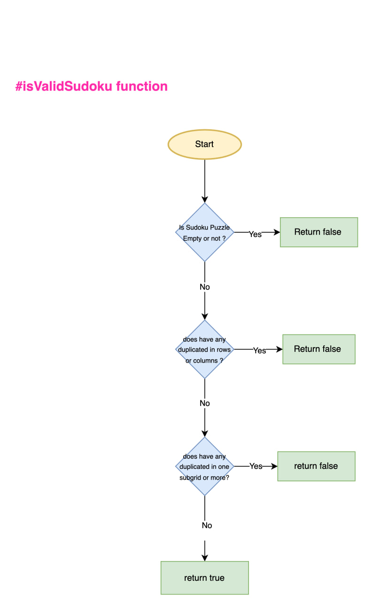

# Sudoku Puzzle Checker 
A simple console app for applying TDD principle using Kotlin to check a given Sudoku puzzle and check if it was valid or not 

#### Flow chart to represent the logic of the code using Draw.io  [Sudoku puzzle flow chart](https://drive.google.com/file/d/1yf2HhDPOfxHyhaGiFcrkavNbMQ5gSNLz/view?usp=sharing) .

> **Note:** if the flow chart quality was not good you could open it with draw.io .